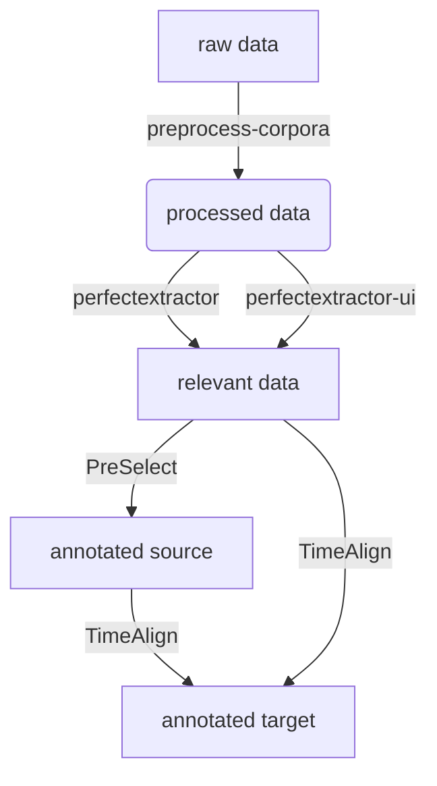

This document describes the technical flow of the _Translation Mining_ web application. The below flow chart describes the flow on a high level:

- The flow starts with raw data that can be preprocessed through the [preprocess-corpora](https://github.com/time-in-translation/preprocess-corpora/) command line scripts.
- After that, you can select relevant data from this processed data through:
    - the [perfectextractor](https://github.com/UUDigitalHumanitieslab/perfectextractor) command line interface, 
    - or the graphical interface [perfectextractor-ui](https://github.com/time-in-translation/perfectextractor-ui/) included in this web application.
- The data can then be uploaded to _TimeAlign_ annotation interface and the target language(s) can be annotated.
- However, if your selection of relevant data from the source language can not be automated, you can manually select the to-be-annotated data via _PreSelect_.

This process is described in more detail on the route `/translation-mining/`.

After all data has been annotated, you can create a scenario to create all visualizations. This process is described in detail on the route `/stats/scenarios/manual/`.
