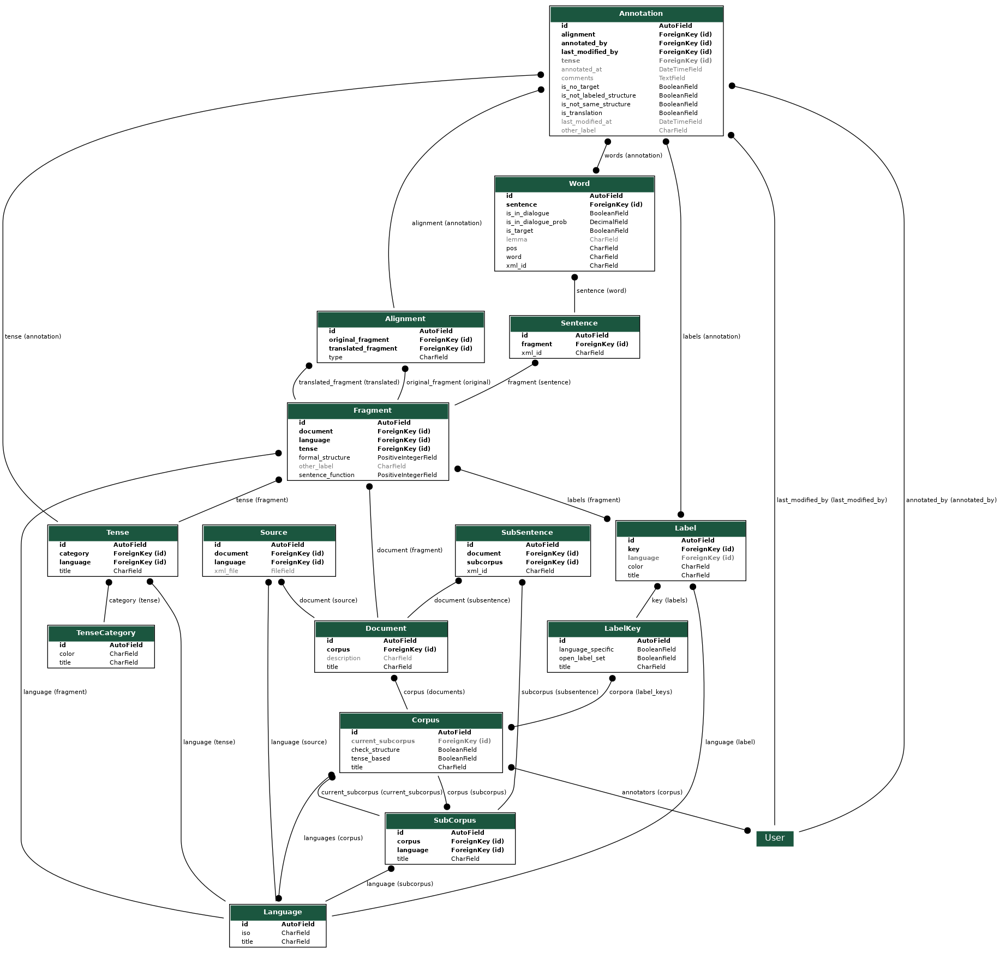

# Models in TimeAlign

## Annotations

### Label System
TimeAlign was orignially built around the concept of tense annotation. This is why the `Tense` model exists, and why every annotation has a foreign-key field that may refer to a tense. At a later stage of development, support was added for a more flexible annotation scheme based on generic labels. Under that new scheme, each annotation (or fragment) may be linked with multiple labels, and it is the reponsiblity of the corpus admin to define what set of labels may be provided by annotators.

The labeling scheme is modeled as follows:
- Each corpus (`Corpus`) is linked to a set of label keys (`LabelKey`) which have descriptive names.
- Each label key is linked to multiple labels (`Label`), however each label may only be linked to one parent label key.
- A label may have a custom color defined.
- A label **key** may be configured in 'open set' mode - this means annotators are allowed to create new labels during annotation. The alternative is limiting annotators to use only labels pre-defined by the admin.
- A label **key** may be designated as language-specific, which means each label belonging to that key is assigned to a specific language and may only be used to annotate fragments of that language.

#### Implementation details
In the code, both the `Annotation` and `Fragment` model classes extend the `HasLabelsMixin`. The mixin provides the `get_labels()` method that is used throughout the code to access labels in one of two forms:
1. A comma-separated list of labels in a string, used when displaying labels to the user.
1. A tuple of label identifier strings, where each identifier has the form `'Label:1'`, where 1 is the database id of the label. This format is used for running scenarios and saving results.

## Selections

## Stats

# Generating model diagrams (ERD)
Models generated using the `graph_models` command in [Django-extensions](http://django-extensions.readthedocs.io/en/latest/graph_models.html), using the following commands:

    sudo apt-get install graphviz libgraphviz-dev pkg-config
    pip install django-extensions pygraphviz

    # add 'django_extensions' to INSTALLED_APPS in settings.py

    python manage.py graph_models annotations -o annotations.png
    python manage.py graph_models selections -o selections.png
    python manage.py graph_models stats -o stats.png
